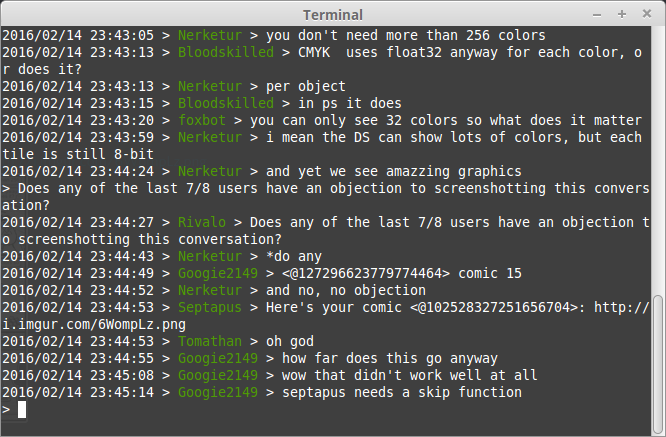

# discord-cli
Minimalistic Command-Line Interface for Discord

Master (Semi-Stable): , Develop (Default Git Branch): 

Join our Discord Chat! https://discord.gg/0pXWCo5RQbVuFHDM

Disclaimer: Currently only tested on Linux.

### How to Install the Master branch?
Currently the easiest working way to install is to use the Go tools. I'm looking at using GCCGO and makefiles to reduce installation steps, and make setting PATHS unnecessary.
* Install the Go Tools and setup the `$GOPATH` (There are loads of tutorial for this part)
* `$ go get -u github.com/Rivalo/discord-cli`
* Go to the `bin` folder inside your `$GOPATH`
* `./discord-cli`

For trying the develop branch, do a git checkout and reinstall the application.

### (Master) Configuration Settings
Configuration files are being stored in JSON format and are automatically created when you first run discord-cli. Do not change the 'key' value inside `{"key":"value"}`, this is the part that discord-cli uses for parsing, missing keys will definitely return errors.

| Setting       | Function         |
| ------------- |-------------|
| username      | Discord Username (emailaddress) |
| password      | Discord Password |
| messagedefault| (true or false) Display messages automatically|
| messages   | Amount of Messages kept in memory |

NOTE: The Configuration settings are likely to change. Breaking updates are stated in the release section. To solve problems, delete `~/.config/discord-cli/config.json` and restart discord-cli.

### (Master) Chat Commands
When inside a text channel, the following commands are available:

| Command       | Function         |
| ------------- |-------------|
| :q      | Quits discord-cli |
| :g      | Change listening Guild|
| :c      | Change listening Channel inside Guild |
| :m [n]      | Display last [n] messages: ex. `:m 2` displays last two messages |
